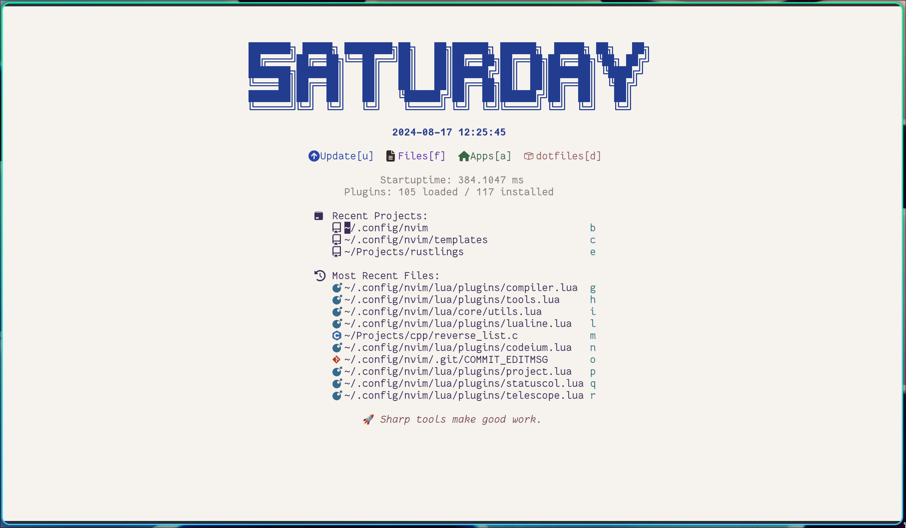

# Winston's Neovim configuration in Lua

## Screenshots

colorscheme: `dayfox`

## Introduction
My personal `Neovim` configuration, nothing special.

- Modern: Using Lua as the config language, adopting as many fancy features as possible in the nightly version of `Neovim`.
- Modular: Each plugin has its dedicated config file.
- Documented (TODO): The goal is to easily recall what this line/file does.

**Neovim >= 0.11 is required**

## Installation
Backup your existing config with `mv ~/.config/nvim{,.bak}`
Run `git clone https://github.com/ZWindL/VVimston.git ~/.config/nvim`

## File Structure
```
 .
├──  init.lua                  # main config
├──  lua
│  ├──  core                   # core configurations don't rely on plugins
│  │  ├──  autocmds.lua
│  │  ├──  constants.lua       # icons, colors, etc
│  │  ├──  keymaps.lua         # global keymaps
│  │  ├──  lazy_n_hotpot.lua   # package managers
│  │  ├──  neovide_options.lua # neovide specific options
│  │  ├──  options.lua         # global options
│  │  └──  utils.lua           # common utils like `map`, `map_group`
│  ├──  plugins                # plugin configurations
│  │  ├──  barbar.lua          # in general, each plugin has its own config
│  │  ├──  which-key.lua
│  │  ├── ...
│  │  ├──  dap                 # configurations for debugging
│  │  │  └── ...
│  │  ├──  hydra               # hydra configurations
│  │  │  └── ...
│  │  ├──  lang                # language specific plugins
│  │  │  └── ...
│  │  ├──  lsp                 # language server protocol
│  │  │  ├──  lang_settings    # language server settings for different languages
│  │  │  │  └── ...
│  │  │  ├──  init.lua
│  │  │  ├──  lsp.lua          # language server configuration for lsp itself
│  │  │  └── ...
│  │  └──  treesitter          # treesitter configurations
│  │     └── ...
│  ├──  theme.lua
│  └──  themes
│     └── ...
└──  templates                 # templates for templates.nvim plugin
   └──  lua
      └──  config.lua
```

## Features
### Themes

### UI Enhancement
- Theming Nvim splash screen: [dashboard-nvim](https://github.com/nvimdev/dashboard-nvim)
- Tab bar: [barbar.nvim](https://github.com/romgrk/barbar.nvim)
- Status line: lualine

### Tools
- Auto remove incsearch highlight: [hlsearch](github.com/nvimdev/hlsearch.nvim)

### Dev tools
#### Lsp related tools
- Lsp UI enhancement: [lspsaga](https://github.com/nvimdev/lspsaga.nvim)

#### Other useful tools

## Dependencies
`fswatch` for better performance while watching files.
`ttf-nerd-fonts-symbols` for symbols.


## Known issues
### `vim.opt.formatoptions`
I want nvim not to auto-insert comment lead characters after pressing `o` or `O`, but does after hitting enter.
This can be configured via `vim.opt.formatoptions`, however it won't set `"r"` by operating directly on this
option as `vim.opt.formatoptions += "r"`, because options are table type. And if modify it by using
`vim.opt.formatoptions:append { "c", "q", "j", "r" }` inside `autoCmd` blocks, nvim reports "illegal character"
error. The workaround is to hardcode the value of `formatoptions` and remove the unwanted options by
`formatoptions:remove` inside`autoCmd`, although it's not recommended, see `:help formatoptions`.

### `noice` `cmdline` popup window resets certain options
Some options like custom icons for diagnosis will be reset to default after invoking `noice` `cmdline` popup window.


## Inspiration
- [LazyVim](https://github.com/LazyVim/LazyVim)
- [Sergio's config](https://bitbucket.org/sergio/mylazy-nvim)
- [Allaman's Nvim config](https://github.com/Allaman/nvim/tree/main)

# Remove Telescope
## Dependencies
[x] lua/plugins/lsp/dropbar.lua (the picker)
[x] lua/plugins/telescope-undo.lua
[x] lua/plugins/noice.lua (the picker)
[x] lua/plugins/project.lua
trouble, the depedency is written in telescope's config

# TODOs
[ ] Signature.nvim
[x] Replace telescope with fzf-lua
[x] Remove outline.nvim
[x] https://github.com/stevearc/aerial.nvim
[ ] https://github.com/folke/snacks.nvim
[x] https://github.com/petertriho/nvim-scrollbar
[ ] Harpoon
[ ] Resolve the startup message.
[ ] https://github.com/ph1losof/ecolog.nvim  .env manager
[ ] Support DAP (Use fzf-lua)
